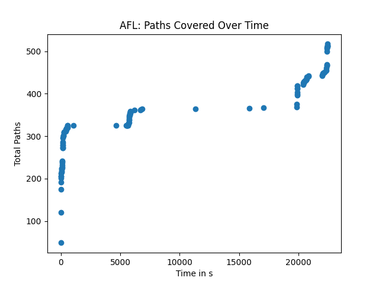

# Test Automation Report

## AFL For Libpng

### Manual VS Automated

AFL was seeded with the same images that were used when manually testing coverage of libpng. AFL produced higher coverage: 40.52% compared to the 38.79% achieved with the manual set of images. In order to compile this test suite, AFL ran for 6 hours, 14 minutes and 17 seconds to produce 518 files. The generated images were a superset of the images from the manual test suite. This was verified by gcov: the coverage of the combined test suite of AFL-generated images and the manual images was 40.52%. The images in the automated test suite are identical to the images in the manual test suite in the common case.

### Interesting Images In Automated Test Suite

#### This image is interesting because it appears to be incomplete, which suggests that an effective test case for libpng is a valid image that exhibits invalid or barely-valid attributes.


#### This image is interesting because it is monochromatic and apparently boring, which asserts that a simple test for the common case is an effective test case to prove a program's basic correctness


### Results

#### Scatterplot of Results



#### Dataset `tail()`

```
     seconds  cycles_done  cur_path  paths_total  pending_total  pending_favs map_size  unique_crashes  unique_hangs  max_depth  execs_per_sec
118    22411            0         7          510            504           150    7.35%               0            11          2         300.98
119    22416            0         7          512            506           150    7.35%               0            11          2         274.80
120    22437            0         7          513            507           150    7.35%               0            11          2         367.76
121    22452            0         7          514            508           150    7.35%               0            11          2         433.69
122    22457            0         7          517            511           150    7.35%               0            11          2         302.18
```

## Evosuite For JSoup

### Manual VS Automated

Evosuite produced results with varying degrees of efficacy compared to the integrated test suite for JSoup. Evosuite produced better branch coverage across the entire `org.jsoup.examples` class, and worse branch coverage across the entire `org.jsoup.parser` class. In the former example, the included test suite had 0% branch coverage, while in the latter it had 73%. There are other cases where Evosuite produced branch coverage within a class that the included test suite had none, such as `org.jsoup.HttpStatusException`. This suggests that Evosuite is best suited for coming up with test cases that have adequate but not excellent coverage in the common case.

### Analysis of `org.jsoup.examples`

This test case wrote a collection of 6 files found in the `/org/jsoup/examples` folder. A number of these files consisted of hundreds of lines of static array declaration, which is a typical attribute of machine generated code. These arrays contribute a significant number of lines of code where a programmer would have a difficult time understanding and an impossible time testing, but a program could read and parse with no difficulty whatsoever. Programs could use these test cases to find a bug far easier than a human because of the labor required to parse the data, and the insight needed to comprehend the results.

These test cases generate random strings and use them to initialize classes within the program to test the program's behavior in a brute-force manner. These types of tests would consume a great number of hours for a programmer and would be considered ineffective relative to the cost to produce, and furthermore can be cheaply produced & distributed using a program such as Evosuite. 

### Analysis of `org.jsoup.parser`

The parser class has a large variety of components to test, and Evosuite struggled to produce coverage for all of them. A cursory glance of the Evosuite test cases reveals that the majority of the tests produced are strikingly similar, which would provide some explanation as to why it produced worse coverage. A tester would naturally choose to deliberately test each class individually, but Evosuite took the same approach as above and created large lists of classes to test the code with as a sequence of tests. This approach suggests that Evosuite took a breadth-first approach, and mutated each test class in some small way while keeping all other aspects of the test the same. For example:

```
"org.jsoup.select.Evaluator$IndexLessThan",
"org.jsoup.parser.TokeniserState$36",
"org.jsoup.parser.TokeniserState$37",
"org.jsoup.parser.TokeniserState$30",
"org.jsoup.parser.TokeniserState$31",
"org.jsoup.parser.TokeniserState$32",
"org.jsoup.parser.TokeniserState$33",
"org.jsoup.nodes.Entities$EscapeMode",
"org.jsoup.nodes.Document$OutputSettings",
"org.jsoup.select.Evaluator",
"org.jsoup.helper.StringUtil",
"org.jsoup.parser.TokeniserState$38",
"org.jsoup.parser.TokeniserState$39",
"org.jsoup.parser.TokeniserState$45",
"org.jsoup.parser.TokeniserState$46",
"org.jsoup.parser.TokeniserState$47",
"org.jsoup.helper.Validate",
"org.jsoup.parser.TokeniserState$48",
```
This is a random selection from a test case produced by Evosuite. Each value is similar in nature, which means they would each produce similar coverage when run on JSoup. It would take a significantly larger test case to show enough variation in content to produce comparable coverage to a human-made test case that was less exhaustive but more varied. (eg. testing each class once)

## Automated Tests In General

The automated test generators produce a higher volume of largely similar test cases. This can be described as having high breadth in generated tests, but not depth. This is optimal when testing a program that has characteristically low variation in functionality but a large variety input domain. The programs automatically generate lots of possible inputs that are apt for covering all possible test inputs for that function, which translates to a larger branch coverage for that function. 

Automated test generators are not optimal when testing a program with high variation in functionality and any volume of input domain. The automated test cases struggle to produce a test suite with sufficient depth to cover each function within the program because the depth of test input variation remains low. In short, the test suites can produce good coverage for one use case but struggles to cover all use cases. When testing programs that match those characteristics, it would be better to write test cases manually, or give further direction to automated test generators. One such direction would be to apply the "high breadth, low depth" approach to each class individually.
